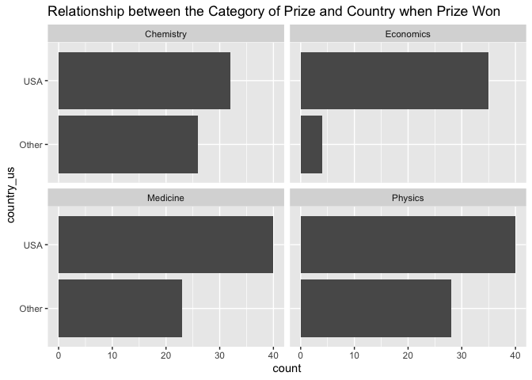

Lab 03 - Nobel laureates
================
Lilly McClendon
01-30-2025

### Load packages and data

``` r
library(tidyverse) 
```

``` r
nobel <- read_csv("data/nobel.csv")
```

## Exercises

### Exercise 1

``` r
library(skimr)
skim(nobel)
```

|                                                  |       |
|:-------------------------------------------------|:------|
| Name                                             | nobel |
| Number of rows                                   | 935   |
| Number of columns                                | 26    |
| \_\_\_\_\_\_\_\_\_\_\_\_\_\_\_\_\_\_\_\_\_\_\_   |       |
| Column type frequency:                           |       |
| character                                        | 21    |
| Date                                             | 2     |
| numeric                                          | 3     |
| \_\_\_\_\_\_\_\_\_\_\_\_\_\_\_\_\_\_\_\_\_\_\_\_ |       |
| Group variables                                  | None  |

Data summary

**Variable type: character**

| skim_variable         | n_missing | complete_rate | min | max | empty | n_unique | whitespace |
|:----------------------|----------:|--------------:|----:|----:|------:|---------:|-----------:|
| firstname             |         0 |          1.00 |   2 |  59 |     0 |      720 |          0 |
| surname               |        29 |          0.97 |   2 |  26 |     0 |      851 |          0 |
| category              |         0 |          1.00 |   5 |  10 |     0 |        6 |          0 |
| affiliation           |       250 |          0.73 |   4 | 110 |     0 |      303 |          0 |
| city                  |       255 |          0.73 |   4 |  27 |     0 |      185 |          0 |
| country               |       254 |          0.73 |   3 |  14 |     0 |       27 |          0 |
| gender                |         0 |          1.00 |   3 |   6 |     0 |        3 |          0 |
| born_city             |        28 |          0.97 |   3 |  29 |     0 |      613 |          0 |
| born_country          |        28 |          0.97 |   3 |  28 |     0 |       80 |          0 |
| born_country_code     |        28 |          0.97 |   2 |   2 |     0 |       77 |          0 |
| died_city             |       327 |          0.65 |   4 |  29 |     0 |      303 |          0 |
| died_country          |       321 |          0.66 |   3 |  16 |     0 |       48 |          0 |
| died_country_code     |       321 |          0.66 |   2 |   2 |     0 |       46 |          0 |
| overall_motivation    |       918 |          0.02 |  55 | 114 |     0 |        7 |          0 |
| motivation            |         0 |          1.00 |  24 | 337 |     0 |      656 |          0 |
| born_country_original |        28 |          0.97 |   3 |  52 |     0 |      122 |          0 |
| born_city_original    |        28 |          0.97 |   3 |  36 |     0 |      616 |          0 |
| died_country_original |       321 |          0.66 |   3 |  35 |     0 |       52 |          0 |
| died_city_original    |       327 |          0.65 |   4 |  29 |     0 |      303 |          0 |
| city_original         |       255 |          0.73 |   4 |  27 |     0 |      185 |          0 |
| country_original      |       254 |          0.73 |   3 |  35 |     0 |       29 |          0 |

**Variable type: Date**

| skim_variable | n_missing | complete_rate | min | max | median | n_unique |
|:---|---:|---:|:---|:---|:---|---:|
| born_date | 33 | 0.96 | 1817-11-30 | 1997-07-12 | 1916-06-28 | 885 |
| died_date | 308 | 0.67 | 1903-11-01 | 2019-08-07 | 1983-03-09 | 616 |

**Variable type: numeric**

| skim_variable | n_missing | complete_rate | mean | sd | p0 | p25 | p50 | p75 | p100 | hist |
|:---|---:|---:|---:|---:|---:|---:|---:|---:|---:|:---|
| id | 0 | 1 | 475.12 | 277.83 | 1 | 234.5 | 470 | 716.5 | 969 | ▇▇▇▇▇ |
| year | 0 | 1 | 1970.44 | 33.30 | 1901 | 1947.0 | 1976 | 1999.0 | 2018 | ▃▃▅▆▇ |
| share | 0 | 1 | 1.99 | 0.94 | 1 | 1.0 | 2 | 3.0 | 4 | ▇▇▁▅▂ |

``` r
print(nobel)
```

    ## # A tibble: 935 × 26
    ##       id firstname   surname  year category affiliation city  country born_date 
    ##    <dbl> <chr>       <chr>   <dbl> <chr>    <chr>       <chr> <chr>   <date>    
    ##  1     1 Wilhelm Co… Röntgen  1901 Physics  Munich Uni… Muni… Germany 1845-03-27
    ##  2     2 Hendrik A.  Lorentz  1902 Physics  Leiden Uni… Leid… Nether… 1853-07-18
    ##  3     3 Pieter      Zeeman   1902 Physics  Amsterdam … Amst… Nether… 1865-05-25
    ##  4     4 Henri       Becque…  1903 Physics  École Poly… Paris France  1852-12-15
    ##  5     5 Pierre      Curie    1903 Physics  École muni… Paris France  1859-05-15
    ##  6     6 Marie       Curie    1903 Physics  <NA>        <NA>  <NA>    1867-11-07
    ##  7     6 Marie       Curie    1911 Chemist… Sorbonne U… Paris France  1867-11-07
    ##  8     8 Lord        Raylei…  1904 Physics  Royal Inst… Lond… United… 1842-11-12
    ##  9     9 Philipp     Lenard   1905 Physics  Kiel Unive… Kiel  Germany 1862-06-07
    ## 10    10 J.J.        Thomson  1906 Physics  University… Camb… United… 1856-12-18
    ## # ℹ 925 more rows
    ## # ℹ 17 more variables: died_date <date>, gender <chr>, born_city <chr>,
    ## #   born_country <chr>, born_country_code <chr>, died_city <chr>,
    ## #   died_country <chr>, died_country_code <chr>, overall_motivation <chr>,
    ## #   share <dbl>, motivation <chr>, born_country_original <chr>,
    ## #   born_city_original <chr>, died_country_original <chr>,
    ## #   died_city_original <chr>, city_original <chr>, country_original <chr>

1.  There are 935 observations, and there are 25 variables in the
    dataset (26 variables if you include the ID column). Each row
    represents a different nobel prize winning individual.

``` r
library(dplyr)
nobel_living <- nobel %>% 
  filter(!is.na(country)) %>% 
  filter(gender != "org") %>% 
  filter(is.na(died_date))
nrow(nobel_living)
```

    ## [1] 228

### Exercise 2

``` r
nobel_living <- nobel_living %>%
  mutate(
    country_us = if_else(country == "USA", "USA", "Other")
  )
```

``` r
nobel_living_science <- nobel_living %>%
  filter(category %in% c("Physics", "Medicine", "Chemistry", "Economics"))
```

``` r
nobel_living_science %>% 
  ggplot(aes(x=country_us)) + 
  geom_bar() + 
  ggtitle("Relationship between the Category of Prize and Country when Prize Won") + 
  facet_wrap(~category) + 
  coord_flip()
```

<!-- -->

#### Visualization Interpretation

For the Nobel Prize categories of chemistry, economics, medicine, and
physics, more prizes have been awarded when the individual resides in
the U.S. However, there is a greater difference for some categories than
others. There seems to be quite a large proportion of economic Nobel
prizes awarded to individual’s currently residing in the U.S. Given this
faceted bar plot, I would say that the Buzzfeed data seems to be
supported by the data.

### Exercise 3

Remove this text, and add your answer for Exercise 1 here. Add code
chunks as needed. Don’t forget to label your code chunk. Do not use
spaces in code chunk labels.

### Exercise 4

…

### Exercise 5

…

### Exercise 6

…
